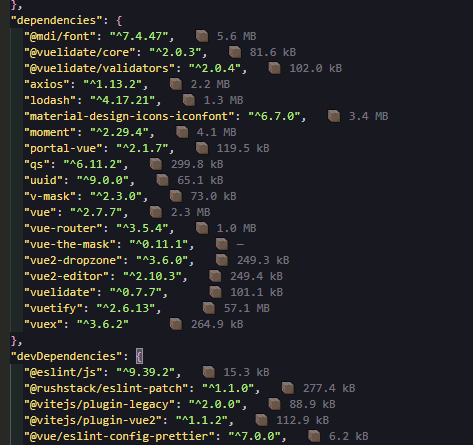

# Package Size Inline

A VS Code extension that shows **package sizes** (in kB/MB) inline next to each dependency in `package.json` under `dependencies` and `devDependencies`.

Sizes are fetched from the **npm Registry** (`unpackedSize`). For `file:` dependencies, the size shown is the size of the package as installed in `node_modules` (built/minified output).

## Example



Inline annotations (e.g. **5.6 MB**, **81.6 kB**) appear next to each package version.

## How to use

1. Install the extension (or run from folder via **Run and Debug**).
2. Open any `package.json`.
3. Each dependency line will show a label like `📦 12.5 kB` to the right (or `—` if the size could not be determined).

## Settings

- **packageSizeInline.enabled** — Turn inline size display on or off.

## Development

```bash
cd package-size-inline
npm install
npm run compile
```

In VS Code: **Run and Debug** → **Run Extension**. A new window opens with the extension loaded; open any `package.json` there.

## Packaging .vsix

```bash
npm install -g @vscode/vsce
vsce package
```

Then: **Extensions** → **...** → **Install from VSIX** and select the `.vsix` file.

## License

MIT — see [LICENSE](LICENSE).
